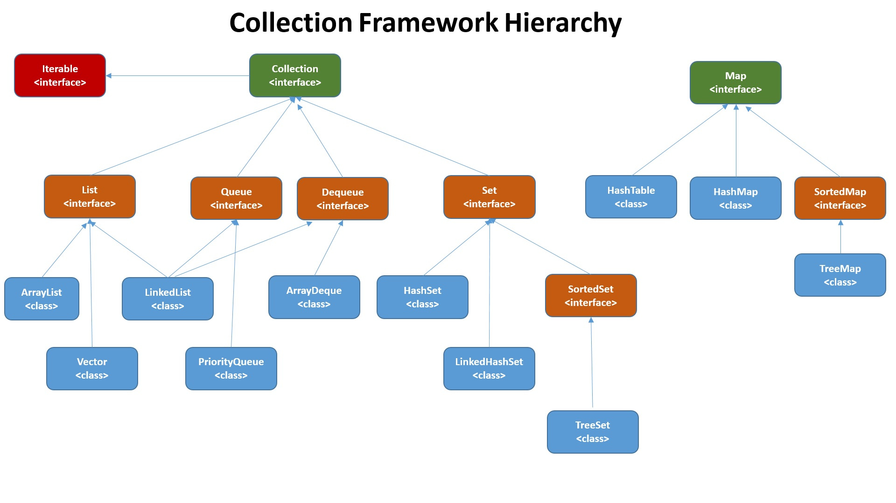
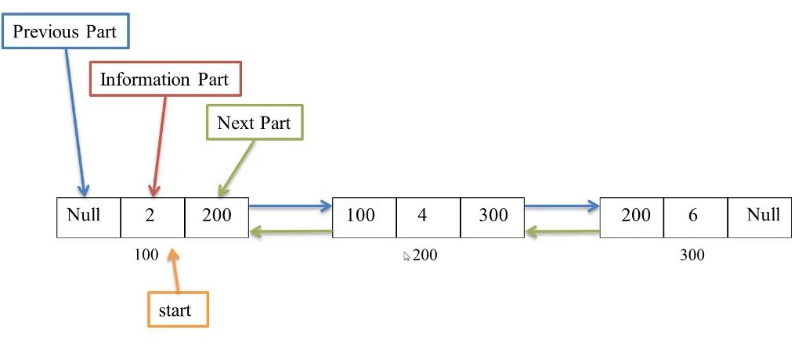

# JAVA INTERVIEW QUESTION
##

### IS JAVA PLATFORM INDEPENDENT?
Yes, We can build our application to one platform and run it on other platform. For an example we can build our application in windows os and run it in mac os

### HOW PLATFORM INDEPENDENCE IS ACHIEVED
With JVM. We compile the Java code we have the **.class** file, which contain the bytecode. JVM converts this bytecode into machines language which any os can understand

### Explain JVM, JDk and JRE
**JVM (Java Virtual machine)** - converts JAVA bytecode into machines language
**JRE (Java Runtime Environment)** - is used to run java application. It contains Java Virtual machine (JVM), core classes and supporting files
**JDK (Java Development Kit)** -  is used to develop Java applications. It contains Java Runtime Environment (JRE), a compiler (javac), archiver (jar) and some extra tools to write java program.

**NB** - javac only have in JDK

### What is class loader and its use
Java program have some custom classes and some core classes (in-built). When program is executed JVM needs to load the content of all the class, so JVM use class loader to find the classes

Java have 3 types of class loader: 

* **System Class Loader** - load classes from the classpath
* **Extension Class Loader** - load all class from extrnsion class directory
* **Bootstrap Class Loader** - load the core classes

### Why is main method Static
Java main() method is always static, so that compiler can call it without the creation of an object of the class. In any Java program, the main() method is the starting point from where compiler starts program execution

### If we remove static keyword from main() method then will the program compile?
Yes it will compile but won't execute

### Can we have multiple main method
Yes, But we can have only one main method with following signature : **public static void main(String[] args)**

### what happens when main exception is thrown by main method
Java runtime terminates the program and print the exception message

### Can we overload main method in java
Yes, but execution will strat from this main method : **public static void main(String[] args)**

### Can we override main method in java
No, we cannot override main method of java because a static method cannot be overridden. See this example: [static_method_cannot_be_overridden.java](src/static_method_cannot_be_overridden.java)

### What is Singleton Class
a singleton class is a class that can have only one object.

**Example**: - [singleton_class.java](src/singleton_class.java)

## String, StringBuffer and StringBuilder

### What is immutable object in Java
immutable means unchangeable.Once object is created its data can't be changed. Example: wrapper class, string class etc..
**Example**: - [immutable_object_in_Java.java](src/immutable_object_in_Java.java)

### Why string objects are immutable in java
Suppose there are 5 reference variables,all referes to one object.If one reference variable changes the value of the object, it will be affected to all the reference variables. That is why string objects are immutable in java, once created can't be changed, any modification means a new object is created.

### What is the difference between String str="hello" and String strNew=new String("world")
1) When we write **String str="hello"**, only one object is created in **string constant pool**
2) When we write **String strNew=new String("world")**, two object are created one in **string constant pool** and other in **heap memory**

**string constant pool** - is a separate place in the heap memory where the values of all the strings are stored

### How many object are created if we have both the line in our code String str="test" and String strNew=new String("test")
Ans) - 2
**String str="test"** - for this line one object is created in **string constant pool**
**String strNew=new String("test")** - for this line one object is created in **heap memory** and other object is reused form string constant pool, Because in string constant pool have same object value.

### How many object are created if we have both the line in our code String str="hello" and String strNew=new String("world")
Ans) 3.
**String str="hello"** - for this line one object is created in **string constant pool**
**String strNew=new String("world")** - for this line one object is created in **heap memory** and other object in **string constant pool**. Because two value is different

### What are Mutable Objects
The mutable objects are objects whose value can be changed after initialization. For example, **Java.util.Date, StringBuilder, StringBuffer,** etc.

### Advantage of StringBuffer over String
```
String str="test"
String newStr="test1"
for(int i=0;i<100;i++)
{
  newStr=newStr+str;
}
```
In this case 100 objects are created, for each iteration a new object will be ceated, because string is immutable.

```
String str="test"
StringBuffer newStr=new StringBuffer("test1");
for(int i=0;i<100;i++)
{
  newStr.append(str);
}
```
In this example on every iteration of for loop a new object is not getting created and a same obbject is getting modified, because StringBuffer is mutable whose value can be changed after initialization.

So, we used StringBuffer insted of String. Because, String create more object in memory which created performance issue in our progrram


### Difference between StringBuffer and StringBuilder
1) StringBuffer is thread safe. StringBuilder is non thread safe
2) StringBuilder give better performance than StringBuffer

## Method of Object class

### What is Super Class of every class in java
Object is Super Class of every class

### Name some method of object class
equals(), hashCode(), toString(), clone(), finalize()

### Difference between equals() and ==
1) == is operator and equals() is method
2) == checks if both objects point to the same memory location whereas .equals() evaluates to the comparison of values in the objects

### What happens if we compare a Object with null using equals() method
obj1.equals(obj2);
If obj2 is null then it return false
If obj1 is null then it gives nullpointer exception 

### What does hashCode() do
It is a method of Object class. It returns the memory reference of an object at integer format. For this it use hashing technique

### Can two object which are not equal have same hashCode()
Yes. If two objects are equal hashCode will always be same. But if hashCode is same that does not guarantee the object are equal

### what is instanceof
 is used to check whether an object is an instance of a particular class or not. instanceof returns true even if we compare with subclass because subclass is instance of superclass
Example: - [instanceof_at_java.java](src/instanceof_at_java.java)

### what is getClass() method
getClass() is the method of Object class. This method returns the runtime class of this object.
```
Object obj = new String("JavaTpoint");   
System.out.println("Class of Object obj is : " + a.getClass().getName());

Output: - Class of Object obj is : java.lang.String
```
### finalize() method in Java
The finalize() method of Object class is a method that the Garbage Collector always calls just before destroying the object which is eligible for Garbage Collection
[finalize_method.java](src/finalize_method.java)

## Wrapper class

### what is wrapper class in java
Wrapper classes provide a way to use primitive data types (int, boolean, etc..) as objects.
```
primitive type       default value     wrapper class                  default value
byte	                   0             Byte                              null
short	                   0             Short                             null
int	                     0             Integer                           null
long	                   0             Long                              null
float	                   0.0           Float                             null
double	                 0.0           Double                            null
boolean	                 false         Boolean                           null
char	                                 Character                         null
```

### Advantage of wrapper class
1) Primitive values can't be null, but a wrapper can be null
2) Wrapper can be used in collections, because collections does not support primitive type. Example: - ``` List<int> list=new ArrayList<>() //invalid```

### What are different ways to create wrapper class
1) Integer value=new Integer(10) // using constructor. this always create new object 
2) Integer value=Integer.valueof(10) // using valueof static method.

### What is Autoboxing and Unboxing in Java
**Autoboxing** - Converting a primitive value to its corresponding wrapper class object is called autoboxing.
```
Character gfg = 'a';
```
**Unboxing** - Converting a wrapper object to its corresponding primitive value is called unboxing
```
Integer value=new Integer(10);
int val=value;
```
### Disadvantage of wrapper class
1) wrapper class is extremly slow compared to its primitive type
2) If we use wrapper class beware of null values.
```
public class HelloWorld {
    static Integer value;
    public static void main(String[] args) {
        value=value+1;              // value = null+1 because by default value of wrapper object is null
        System.out.println(value);  // In this case we get nullpointer exception
    }
}
```
### What is type casting
Converting one data type to another

In Java, there are two types of casting:

* **Widening Casting (automatically done by compiler)** - converting a smaller type to a larger type size 
  **byte -> short -> char -> int -> long -> float -> double**
```
int value=1000;
double num=value;
```
* **Narrowing Casting (manually written in code)** - converting a larger type to a smaller size type
**double -> float -> long -> int -> char -> short -> byte**
```
long num=2230;
int value=(int) num;
```

## Inheritance

### What is Inheritance
a new class is derived from an existing class this procidure is called inheritance

Java support 3 types of inheritance
1) **single**          classA &#8594; classB
2) **multilevel**      classA &#8594; classB &#8594; classC
3) **hierarchical**    classA &#8594; classB and classC

### What is Polymorphism
we can perform a single action in different ways. We can perform polymorphism in java by method overloading and method overriding.
* **method overloading** - is example of static polymorphism
* **method overriding** - is example of runtime polymorphism

### What is method overloading
multiple methods can have the same name with different parameters (it can be differ by number of input parameters or type of input parameters)
```
// by number of input parameters
private void sum(int x,int y){}
private void sum(int x, int y, int z){}

// by type of input parameters
private void sum(int x){}
private void sum(long x){}

// by different serialization of parameters type
private void sum(int x,long y){}
private void sum(long x, int y){}
```
### what is method overriding
When Super class and Sub class have same method signature
```
class Animal {
  public void animalSound() {
    System.out.println("The animal makes a sound");
  }
}

class Pig extends Animal {
  public void animalSound() {
    System.out.println("The pig says: wee wee");
  }
}

class Dog extends Animal {
  public void animalSound() {
    System.out.println("The dog says: bow wow");
  }
}

class Main {
  public static void main(String[] args) {
    Animal myAnimal = new Animal();  // Create a Animal object
    Animal myPig = new Pig();  // Create a Pig object
    Animal myDog = new Dog();  // Create a Dog object
    myAnimal.animalSound();
    myPig.animalSound();
    myDog.animalSound();
  }
}
```
### Basic Question from Runtime polymorphism
Suppose **Animal** is parent class and **Dog** is its child class and the **animalSound** method is overriden

Animal animal=new Dog();
animal.animalSound();

**Which version is called?**

Ans) - child class method will be called. see this example - [method_overriding.java](src/method_overriding.java)

In runtime polymorphism object can call **overriding methods of child class**, **non overriding methods of parent class** but do not call **non overriding methods of child class**

### Difference between super and super()
**super** - super is used to call super class variables and methods by the subclass object when they are overridden by a subclass

**super()** - super(); is used to invoke the super class’s constructor

## Interface

### What is Interface
An interface is a collection of method declaration without implementation. Another way to achieve abstraction in Java using interface
[interface_example.java](src/interface_example.java)

## Access Modifier

### Visibility of different access modifier
* **default**    - visible in same package
* **protected**  - visible in same package and subclass of different package
* **public**     - visible anywhere
* **private**    - visible only in same class

## Java Abstraction

See Example - [abstract_in_java.java](src/abstract_in_java.java)

### Abstract class
Abstract class is a restricted class that cannot be used to create objects. We can access abstract class from another class using extend.

### Abstract method
Abstract method can only be used in an abstract class, and it does not have a body.

### Can an abstract class have a constructor
Yes

### Can an abstract class implement a interface
Yes

### Can abstract class be final
No

### Can an abstract class have static method
Yes

### Can we create instance of abstract class
No

### Can abstract class have main method
Yes

### When we use super and this
**super()** - to call parent class constructor from child class
**this**    - to call one constructor from other in same class

### Can a constructor have both super and this
Yes, but super must be the first statement

## Java Static

### What is a static method
When we use static keyword to a method this method is called Static Method. Static method can be called without creating object of class. Ex - ClassName.MethodName

### Can we access member variable from static method
No, Static Method can access only Static Variable. Member level method can access both static and member variable

### What is Static Variable
When we use static keyword to a variable this variable is called Static Variable. Static variable get memory allocation only once during class loading

### Can we overload a static method
Yes

### Can we override a static method
No

### How are static block executed
tatic block are executed when class are loaded by the JVM. So, they are called before the main method

## Marker Interface

### What is a marker interface
Interfaces with no methods are called marker interfaces. Example : - RandomAccess, Serializable etc..

### What is RandomAccess
It is a marker interface. ArrayList, HashMap support random access to get any value using index
```
list.get(i) // get() is used to get value of any element. It happend by random access
```
### What is Serializable
It is a marker interface which used to serialize and deserialize java objects
* **Serialization** - convert java object to byte stream. It is done by ObjectOutputStream
* **Deserialization** - convert byte stream to java object. It is done by ObjectInputStream

## Java Exceptions

### Structure of Java Exceptions
* **Throwable** - It is the Super Class of all exceptions and error
  * Exception
    * Runtime Exp
      * Arithmatic Exp
      * ArrayIndexOutOfBound Exp
      * NullPointer Exp
    * IO Exp
    * SQL Exp
    * ClassNotFound Exp
  * Error
  
### Difference between Exception and Error
* **Error**     - Error is caused due to lack of system resources. _Example: - OutOfMemoryError_ etc.
* **Exception** - Exception is caused if have any fault in your code. _Example: - ArrayIndexOutOfBoundException, SqlException_ etc.

### Difference between checked and unchecked exception
* **Checked**    - are checked at compile-time. _Example: - ClassNotFound Exception, SqlException, IOException_ etc.
* **Unchecked**  - are checked at runtime. _Example: - NullPointerException, ArrayIndexOutOfBoundsException, ArithmeticException, IllegalArgumentException, NumberFormatException_

### What is the use of finally block
Code in the finally block is always executed. Does not matter exception is occurs or not

### Will the finally block be execute if there is return statement in try block
Yes

### Is try without catch allow
Yes, then we need try and finally

### Is try without finally and catch allow
No, we required one of them

### What is try with resource
try-with-resources statement is a try statement that declares one or more resources. The resource is as an object that must be closed after finishing the program.
Example: - [try_with_resource.java](src/try_with_resource.java)

### Can we have multiple catch block
Yes, but we mainten order of catch block means child class of exception must be at top and parent class of exception must be at button 
```
catch(ArithmeticException e)
{
    System.out.println("Arithmetic Exception occurs");
}
catch(Exception e)
{
    System.out.println("Parent Exception occurs");
}
```
If we write ArithmeticException under the Exception then we get an error because Exception is parent class of all exception

### Can we have multiple exception in one catch block
Yes, 
```
catch(ArithmeticException | ArrayIndexOutOfBoundsException e)
```
but do not use parent class exception and child class exception together.
```
catch(RuntimeException | ArrayIndexOutOfBoundsException e) // it gives error
```
### Can overriden method in child class throw unchecked exception if parent class method is not throwing any exception
Yes

### Can overriden method in child class throw unchecked exception if parent class method is not throwing any exception
No, the overriding method of child class cannot throw a checked exception if the overridden method of base class is not throwing an exception.
```
class Building {  
   void color()
   {
      System.out.println("Blue");
   }  
}
class Room extends Building{
   void color() throws IOException
   {
      System.out.println("White");
   }
}
```
this give a compile time error. Because the overriding method of child class cannot throw a checked exception if the overridden method of base class is not throwing an exception.

# Collections in Java

The Collection in Java is a framework that provides an architecture to store and manipulate the group of objects.

Collection Framework Hierarchy


### Difference between List and Set
List can contain duplicate values. Set do not allows duplicate values

### Difference between Array and Arraylist
Array | Arraylist
--- | ---
Arrays can contain both primitive data type and object | ArrayList can contain only object
Arrays have fixed size | ArrayList have dynamic size
```int arr[] = new int[3]``` requirde fixed size | ```ArrayList<Integer> list = new ArrayList<Integer>()``` do not required fixed size

### Details about ArrayList
1) ArrayList uses a dynamic array to store the elements
2) ArrayList is slower than LinkedList because it internally uses an array. If any element is removed from the array, all the bits are shifted in memory
3) ArrayList is non synchronized.
4) ArrayList can contain duplicate elements.

**See example of Arraylist**
https://github.com/opendoc-tree/JavaInterviewQuestion/blob/master/src/collection/arraylist

### Details about LinkedList
1) LinkedList uses a doubly linked list to store the elements.
2) LinkedList is faster than ArrayList because it uses a doubly linked list, so no bit shifting is required in memory.
3) LinkedList is non synchronized.
4) LinkedList can contain duplicate elements.

**See example of LinkedList**
https://github.com/opendoc-tree/JavaInterviewQuestion/blob/master/src/collection/linkedlist

### Difference between ArrayList and LinkedList
ArrayList | LinkedList
--- | ---
ArrayList uses a dynamic array to store the elements | LinkedList uses a doubly linked list to store the elements.
ArrayList is slow because it internally uses an array. If any element is removed from the array, all the bits are shifted in memory. | LinkedList is faster than ArrayList because it uses a doubly linked list, so no bit shifting is required in memory.

### Details about HashSet
1) HashSet uses hashing mechanism to store the elements.
2) HashSet contains unique elements only.
3) HashSet allows null value. but can containt only one because it does't allow duplicate value
4) The initial default capacity of HashSet is 16

**See example of HashSet**
https://github.com/opendoc-tree/JavaInterviewQuestion/blob/master/src/collection/hashset

### How can i remove duplicate values in list
Suppose we have list of String with duplicate values

* **1st way** - using Set. Because set can't contain duplicate value
* **2nd way** - using java8 Stream Api

Example - https://github.com/opendoc-tree/JavaInterviewQuestion/tree/master/src/remove_duplicate_value_from_list.java

### How data stored in LinkedList
LinkedList uses doubly linked list to store the element where every element is node. Every node have 3 information: the data, address of the previous node, address of the next node


### When we prefer ArrayList and LinkedList
* **LinkedList** - When there is lot of insertion/deletion operation we prefer LinkedList. Because on every insertion/deletion no bit shifting is required in memory in LinkedList, only the address of the prev and next element are changed, so operation is faster
* **ArrayList** - When we retrive element we prefer ArrayList. Because it implements RandomAccess Interface, So any element can be accese with same speed

### What is Iterator
An Iterator is an object that can be used to loop through collections

## HashMap

**See example of HashMap**
[click on to see hashmap example](src/collection/hashmap)

### How a HashMap work internally
It implements map interface and store data in key-value pair. Internaly HashMap use array of nodes to store the data. Node is represented as a class. Node contain following information

hashcode | Key | Value | node next
--- | --- | ---| ---

**How to work it internally when we put Key-Value to HashMap ?**

Initially Empty HashMap create 16 bucket 

0 | 1 | 2 | 3 | 4 | 5 | 6 | 7 | 8 | 9 | 10 | 11 | 12 | 13 | 14 | 15
--- | --- | ---| --- | --- | --- | --- | --- | --- | --- | --- | --- | --- | --- | --- | ---

```
HashMap<String, Integer> map = new HashMap<>();

map.put(1,"Red");
```

**1** - calculate the hashcode of the key. Suppose it give this value ```2657860```

**2** - calculate the index. Suppose it give the index **4**

```
hashCode(Key) & (n-1) // n is the bucket size
2657860 & (16-1) = 4
```
**3** - So at 4th index the node is stored

**hash collisions?**

Suppose we put another Key-Value pair

```
map.put(2, "Black")
```

1) After calculating the index it gives index **4**. But at 4 index alreay have a node. This is called **Hash Collision**
2) In that case **equals()** method check the Keys are same or not between two nodes
3) If Keys are same, replace the value with current value
4) Otherwise it create a new node at this index and linked with previous node using linked list  

### How does get() method of HashMap work

```
map.get(Key)
```
1) calculate the hashcode of the key
2) Then calculate the index
3) Then HashMap use equals() method to match our key with the keys of the nodes
4) If one is match then get() method return its value

### How does get() method work if two Keys have same hashcode
Two Keys same hashcode means two key have in same bucket. So, equala() method match the key

### How to make custom class as Key in HashMap
We need to override equals() and hashCode() method
Example - [custom_class_as_key_hashmap.java](src/custom_class_as_key_hashmap.java)

### Can HashMap contain duplicate Keys
No, HashMap contain only unique keys. But it can contain duplicate values

### Can HashMap contain null Keys and values
Yes, but it can contain onle one null key and multiple null values

## Comparable & Comparator

### Difference between Comparable & Comparator
Comparable | Comparator
--- | ---
Sorting is done by single field | Sorting is done by multiple field
[comparable_example.java](src/comparable_example.java) | [comparator_example.java](src/comparator_example.java)

## Concurrent collections

### What is thread-safe and non-thread-safe in java
When multiple threads are working on the same data, and the value of our data is changing, that scenario is **not thread-safe** and we will get inconsistent results. When a thread is already working on an object and preventing another thread to working on the same object, this process is called **Thread-Safety**.

### What is Concurrent collections in java
Concurrent collections in java are designed and optimized specifically for synchronized multithreaded access. These are the thread safe collections, and these are existing in java.util.concurrent package.

### Difference between Traditional Collections and Concurrent Collections in java
Traditional Collections | Concurrent Collections
--- | ---
Most of the calss in Traditional Collections are non-synchronized and non-thread-safe | All the classes in Concurrent Collections are synchronized and thread-safe
In Traditional Collections, if a thread is iterating a Collection object and if another thread try to add new element in that iterating object simultaneously then we will get RuntimeException **ConcurrentModificationException** | In that case, we will not get any Runtime Exception if we are Working with Concurrent Collections Classes
Traditional Collections classes is good choice if we are not using thread in our application | Concurrent Collections is good choice if we are using Multiple Threads in our application
 ArrayList, LinkedList, HashMap etc. | CopyOnWriteArrayList, CopyOnWriteArraySet, ConcurrentHashMap etc.

see this example - [diff_traditional_concurrent_collections.java](src/diff_traditional_concurrent_collections.java)

## Generics

### What is Generics
Generics mean parameterized types. A class, interface or method that operates on a parameterized type is called generic.

### Benefits of Generics in Collection Framework
We can hold singale type of object in Generics. It does not allow to store other object. So it avoids class cast exception at runtime
```
Without Generics, we can store any type of objects.

List list = new ArrayList();    
list.add(10);  
list.add("10");  

With Generics, it is required to specify the type of object we need to store. 

List<Integer> list = new ArrayList<Integer>();    
list.add(10);  
list.add("10");// this give compile-time error  
```
### Why we use Generics in Java
It avoid class cast exception at runtime. It provide a compile time checking 

### What is Generics Class
A class that operates on a parameterized type is called generic class

**Example of Generics Class** : [generics_class.java](src/generics/generics_class.java)

**Example of Generics Method** : [generics_method.java](src/generics/generics_method.java)

### What is bounded and unbounded wildcards in Generics?
Bounded and Unbounded wildcards in generics are used to bound any Type. Bounded wildcard have two types

1) **Uper Bounded** - by using **<? extends T>**. It accept only T or its sub-clases

2) **Lower Bounded** - by using **<? super T>**. It accept only T or its super-clases

Single **<?>** is called an **Unbounded** wildcard in generic and it can represent any type

**Example of Bounded wildcards** : https://github.com/opendoc-tree/JavaInterviewQuestion/tree/master/src/generics/bounded_wildcard.java

**Example of Unbounded wildcards** : https://github.com/opendoc-tree/JavaInterviewQuestion/tree/master/src/generics/Unbounded_wildcard.java

### Difference between ArrayList<? extends T>  and ArrayList<? super T>
ArrayList<? extends T> | ArrayList<? super T>
--- | ---
It is Uper Bounded wildcards | It is Lower Bounded wildcards
It accept only T or its sub-clases | It accept only T or its super-clases


# Java 8

### What is Lambda Expression
A lambda expression is a short block of code which takes parameters and returns a value

**Syntax** - 

single parameter with expression
```
parameter -> expression
```
multiple parameters with expression
```
(parameter1, parameter2) -> expression
```
using code blocks to write a lines of code in lambda expression
```
(parameter1, parameter2) -> {code blocks}
```

**Example** - https://github.com/opendoc-tree/JavaInterviewQuestion/tree/master/src/java8/lambda.java

### What is Functional Interface
An Interface that can contains only one abstract method is known as functional interface. It can have any number of default or static method but can contain only one abstract method.

**Example** - https://github.com/opendoc-tree/JavaInterviewQuestion/tree/master/src/java8/functional_interface.java

### What is Method Reference
Method references are a special type of lambda expressions

**Syntax** - 

```
Object :: methodName
```
**Example** - 

```
list.forEach(System.out::println)
```
There are Four type method reference:

1) Static Method Reference. **Example** - https://github.com/opendoc-tree/JavaInterviewQuestion/tree/master/src/java8/reference_static_method.java

2) Instance Method Reference of a particular object. **Example** - https://github.com/opendoc-tree/JavaInterviewQuestion/tree/master/src/java8/reference_instance_method.java 

3) Instance Method Reference of an arbitrary object of a particular type. **Example** - https://github.com/opendoc-tree/JavaInterviewQuestion/tree/master/src/java8/reference_instance_method_object_type.java

4) Constructor Reference. **Example** - https://github.com/opendoc-tree/JavaInterviewQuestion/tree/master/src/java8/reference_constructor.java

### What is Optional
We use optional to avoid nullpointer exception in runtime.
**Example** - https://github.com/opendoc-tree/JavaInterviewQuestion/tree/master/src/java8/optional_example.java

### What is Default Method
Traditionally, Interfaces only used for method declarations (not implementations). But in Java 8 we can implement method in interface using **default** keyword. This method is called default method

**Example** - https://github.com/opendoc-tree/JavaInterviewQuestion/tree/master/src/java8/default_method.java

### In case both the implemented interfaces contain default methods with same method signature
https://github.com/opendoc-tree/JavaInterviewQuestion/tree/master/src/java8/override_default_method.java

### What is Stream API in Java
A Stream in Java 8 can be defined as a sequence of elements from a source. Streams supports aggregate operations on the elements. The source of elements can be Collection or Array that provides data to the Stream.

Stream keeps the ordering of the elements the same as the ordering in the source. The aggregate operations are operations that manipulate stream elements quickly and clearly.

### What is Java Parallel Streams?
Java Parallel Streams is a feature of Java 8 and higher. Normally any java code has one stream of processing, where it is executed sequentially. But by using parallel streams, we can divide the code into multiple streams that are executed in parallel on separate cores
